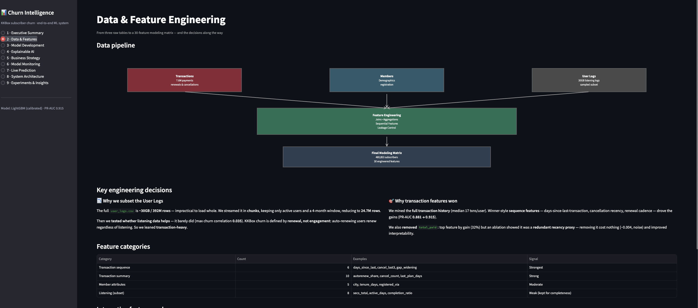
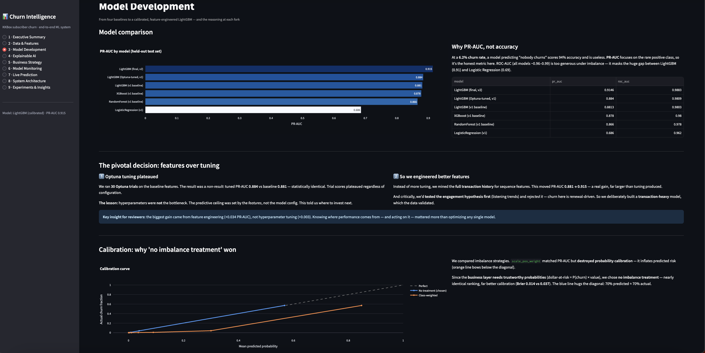
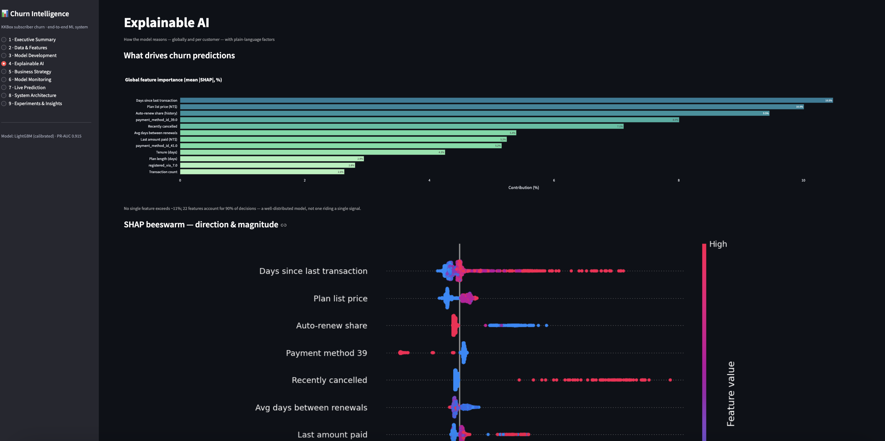
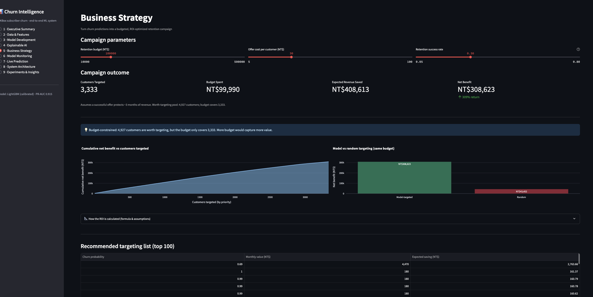
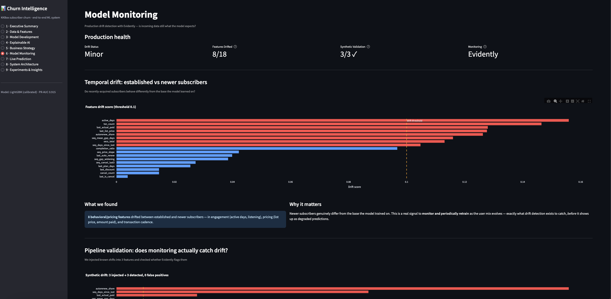
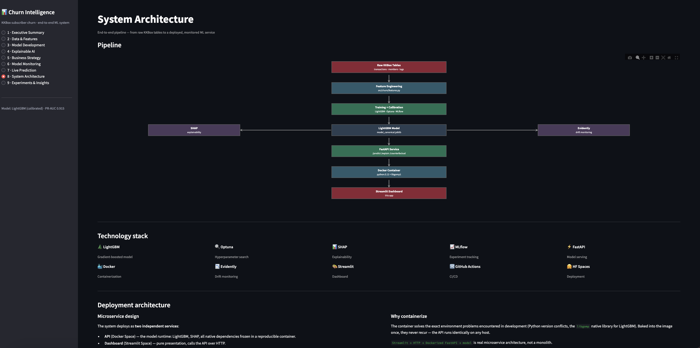
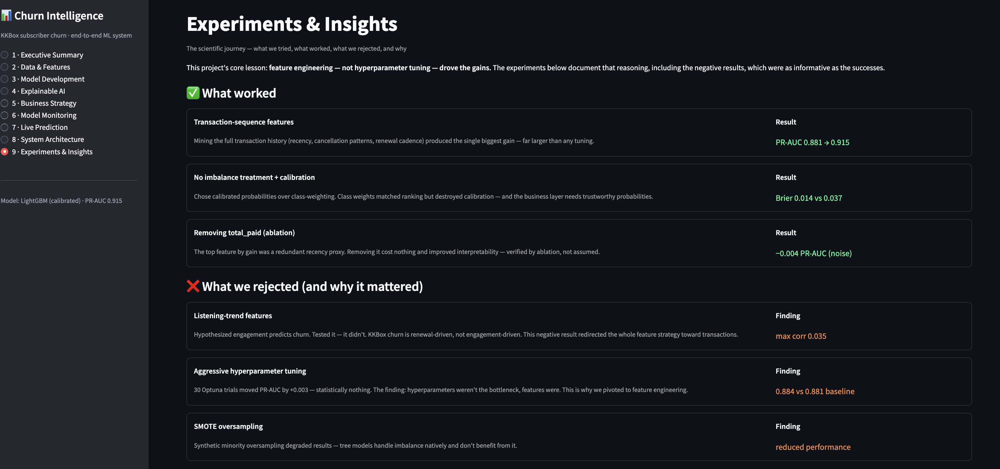

# KKBox Subscriber Churn Prediction — End-to-End ML System

A production-style machine learning system that predicts subscriber churn for KKBox (a Taiwanese music-streaming service), explains *why* each customer is at risk, and translates predictions into a budgeted, ROI-optimized retention strategy. The project spans the full lifecycle: data engineering, modeling, calibration, explainability, a business-decision layer, drift monitoring, a REST API, containerization, and a deployed interactive dashboard.

**🔗 Live demo:** [Dashboard](https://kkbox-churn-prediction-system-eqq9dp5vrxycq6whgmtp4c.streamlit.app/) · [API docs](https://kkbox-churn-prediction-system.onrender.com/docs) · [GitHub](https://github.com/aniketgupta1704-cmd/kkbox-churn-prediction-system)

> ⏱️ *Both services run on free-tier hosting and sleep after inactivity — the first request may take 30–60 seconds to wake.*

---

## TL;DR

- **Model:** Calibrated LightGBM, **PR-AUC 0.915**, log loss 0.121, Brier 0.014 on a held-out test set (6.2% churn base rate).
- **The real story isn't the score — it's the process.** Feature engineering (+0.034 PR-AUC) drove the gains, not hyperparameter tuning (+0.003). A leakage investigation, a rejected engagement hypothesis, and a calibration decision shaped the final design.
- **Business impact (assumption-free headline):** the model concentrates retention spend on customers who churn at **95%** vs the **6%** base rate — a ~15× targeting-efficiency gain.
- **Deployed** as two services: a Dockerized FastAPI model server (Render) and a 9-page Streamlit analytics dashboard (Streamlit Cloud) that calls it over HTTP.

---

## The problem

KKBox subscribers churn when they fail to renew. With a **6.2% churn rate**, this is an imbalanced-classification problem where accuracy is meaningless (predicting "nobody churns" scores 94%). The goal is threefold:

1. **Predict** which active subscribers are likely to churn.
2. **Explain** the drivers, per customer, in business terms.
3. **Act** — turn predictions into a retention campaign that maximizes revenue saved per dollar spent.

---

## Data & feature engineering

The dataset combines three raw KKBox tables: **transactions** (7.6M payment/renewal records, 2015–2017), **members** (static demographics), and **user logs** (~30GB of daily listening activity).

**Key decisions (documented in `notebooks/`):**

- **Scoped to active subscribers** (those with transaction history): 480,853 users. Accounts with no transactions are trivially predicted and not actionable.
- **Subset the user logs.** The full logs are ~30GB / 392M rows. They were streamed in chunks and reduced to a 4-month window — but **testing showed listening data barely predicts churn** (max correlation 0.035). KKBox churn is **renewal-driven, not engagement-driven**: auto-renewing users renew regardless of listening. This negative result redirected the entire feature strategy.
- **Leaned transaction-heavy.** Sequence features mined from the full transaction history — days since last transaction, cancellation recency, renewal cadence — drove the biggest gains.
- **Removed `total_paid`** after an ablation showed it was a redundant recency proxy (−0.004 PR-AUC, noise) — improving interpretability at no cost.

Final matrix: **480,853 subscribers × 30 engineered features.**



---

## Modeling

Four baselines were compared on a held-out test set using **PR-AUC** (the honest metric under class imbalance):

| Model | PR-AUC | ROC-AUC |
|---|---|---|
| **LightGBM (final, v2 features)** | **0.915** | 0.988 |
| LightGBM (Optuna-tuned, v1) | 0.884 | 0.981 |
| LightGBM (v1 baseline) | 0.881 | 0.980 |
| XGBoost | 0.878 | 0.980 |
| Random Forest | 0.866 | 0.978 |
| Logistic Regression | 0.686 | 0.962 |

**The pivotal decision — features over tuning.** 30 Optuna trials moved PR-AUC from 0.881 → 0.884 (statistically negligible), establishing that *hyperparameters were not the bottleneck — the features were*. Investment shifted to feature engineering, which moved PR-AUC 0.881 → 0.915. Knowing *where* performance comes from mattered more than optimizing any single model.

**Calibration.** Class-weighting matched ranking but destroyed probability calibration (Brier 0.037 vs 0.014). Because the business layer needs trustworthy probabilities (dollar-at-risk = P(churn) × value), the final model uses **no imbalance treatment** — nearly identical ranking, far better calibration.



---

## Explainability

**Global (SHAP):** No single feature exceeds ~11% of decisions; 22 features account for 90% — a well-distributed model, not one riding a single signal. Top drivers: days-since-last-transaction, plan list price, auto-renew share, recent cancellation.

**Per-customer:** SHAP waterfalls decompose individual predictions in plain language.

**Counterfactuals (prescriptive):** Beyond predicting churn, the system recommends the single most effective *actionable* retention lever per customer (enable auto-renew, reverse a cancellation, re-engage, offer a discount). Interventions are restricted to features a retention team can influence, and map coherently onto the top SHAP features. Some customers have one dominant action; others get a prioritized menu.



---

## Business layer

The decision layer turns probabilities into dollars via a **retention budget allocator**:

```
expected_saving = P(churn) × monthly_value × months_protected × success_rate − offer_cost
```

Customers with positive expected savings are targeted, ranked by savings, until the budget is spent.

**Results (held-out test set; base case: 30% success rate, NT$30 offer, ~3 months protected, NT$100k budget):**

- **Targeting efficiency (assumption-free):** targeted customers churn at **95.2%** vs the **6.3%** base rate — a **~15× concentration** of real churners.
- **Model vs random:** model-guided targeting nets **+NT$309k**; the same budget spent randomly **loses NT$75k**.
- **Risk concentration:** the Critical segment (95%+ risk) is just 3.6% of customers but holds ~55% of total value-at-risk.

Dollar figures are assumption-dependent (a sensitivity grid is included); the targeting-efficiency and model-vs-random results are robust to the assumptions.



---

## MLOps — drift monitoring

Drift detection with **Evidently**, validated two ways:

- **Temporal drift (real):** comparing established vs newer subscriber cohorts, **8 behavioral/pricing features drifted** — a real signal that the model should be monitored and retrained as the user base evolves.
- **Synthetic validation:** injecting known shifts into 3 features, Evidently flagged **exactly those 3, with 0 false positives** — proving the monitoring pipeline works.

The monitored features overlap with the top SHAP features — drift is watched where it would most degrade the model.



---

## Architecture & deployment

```
Raw KKBox Tables → Feature Engineering → Training (LightGBM + calibration) → Model
      → SHAP / Evidently / FastAPI → Docker → Streamlit Dashboard
```

**Microservice design, deployed as two independent services:**

- **API** — a Dockerized FastAPI service (`/predict`, `/explain`, `/counterfactual`, `/predict_batch`) hosted on **Render**. The container packages Python 3.12, LightGBM, SHAP, and all native dependencies (e.g. OpenMP) into one reproducible image — solving environment issues once, permanently.
- **Dashboard** — a 9-page Streamlit analytics app hosted on **Streamlit Community Cloud**. It's a pure presentation layer (no ML dependencies) that calls the API over HTTP for live inference.

This separation keeps the frontend lightweight and isolates the fragile ML runtime in the container.



### Tech stack

`LightGBM` · `Optuna` · `SHAP` · `Evidently` · `FastAPI` · `Docker` · `Streamlit` · `Plotly` · `scikit-learn` · `pandas`

---

## Key findings (the scientific journey)

**What worked:**
- Transaction-sequence features (PR-AUC 0.881 → 0.915) — the biggest gain.
- Calibrated, no-imbalance-treatment model (Brier 0.014 vs 0.037) — trustworthy probabilities for the business layer.
- Removing `total_paid` — verified redundant by ablation.

**What was rejected (and why it mattered):**
- **Listening-trend features** (max correlation 0.035) — churn is renewal-driven, not engagement-driven. This shaped the whole feature strategy.
- **Aggressive hyperparameter tuning** (+0.003) — features, not hyperparameters, were the bottleneck.
- **SMOTE oversampling** — degraded performance; trees handle imbalance natively.

**The meta-lesson:** knowing where performance comes from — and documenting what *didn't* work — mattered more than optimizing any single component.



---

## Repository structure

```
├── app/                    # FastAPI service (api.py, schemas.py)
├── dashboard/              # Streamlit dashboard (9 pages + assets)
│   ├── streamlit_app.py
│   ├── pages_lib/          # page modules + shared helpers
│   └── assets/             # pre-computed figures, JSONs, CSVs
├── notebooks/              # 01–07: EDA, tuning, features, SHAP, business, drift, counterfactuals
├── src/churn/              # feature engineering pipeline
├── models/                 # model_canonical.joblib
├── Dockerfile              # containerizes the API
└── requirements.txt        # API dependencies
```

---

## Running locally

**API:**
```bash
pip install -r requirements.txt
uvicorn app.api:app --port 8000
# docs at http://127.0.0.1:8000/docs
```

**Dashboard** (in a second terminal, with the API running):
```bash
pip install -r dashboard/requirements.txt
streamlit run dashboard/streamlit_app.py
```

**Docker (API):**
```bash
docker build -t churn-api .
docker run -p 8000:8000 churn-api
```

---

## Notes & honest limitations

- Business-impact dollar figures depend on assumptions (retention success rate, offer cost, protected horizon) that a real team would measure via A/B testing; they're presented as illustrative and bounded by sensitivity analysis.
- Counterfactuals are model-space, ceteris-paribus what-ifs — decision support, not guarantees.
- Drift monitoring uses temporal cohorts as a proxy for production drift, since the dataset is a single static snapshot.
- The model's raw PR-AUC (0.915) is solid but not extraordinary — the dataset is fairly separable. The project's value is in the *complete, honest, end-to-end system*, not the headline metric.

---

*Built by Aniket Gupta. Currency is New Taiwan Dollar (NT$), matching the KKBox dataset.*